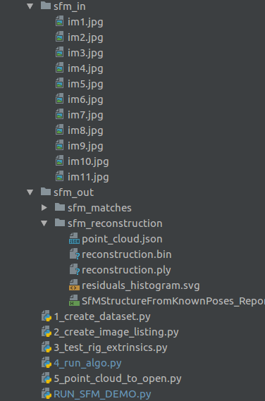
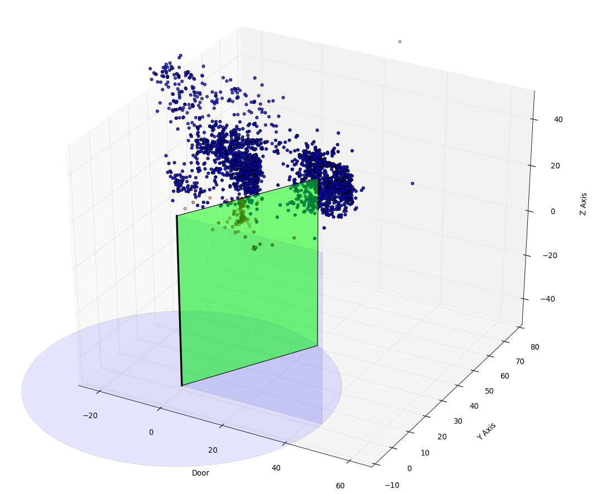
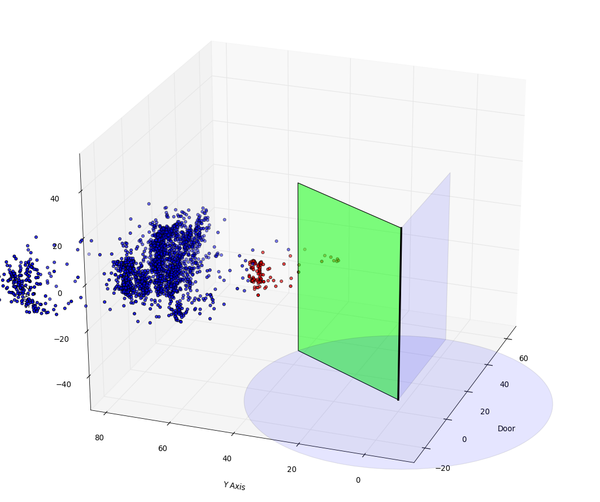

# Door SFM

A modular algorithm for monocular structure from motion via OpenMVG (Open Multiple View Geometry) aimed at using the wide angle side camera's motion through the power mirror's pivot to attain a semi-dense depth map of the surroundings in order to determine a set point for maximum door open angle without hitting objects (like curbs, poles, adjacent cars, etc). The algorithm assumes a calibrated camera and known extrinsic parameters with respect to a pre-defined world coordinate system. The project was originally built in Ubuntu 14.04 in the PyCharm python IDE with no changes to the OpenMVG C++ binaries.

### Project Structure

To maintain the flexibility and modularity in the project, we break down the input to output process into 5 seperate python scripts.
* **1_create_dataset:** Communicates over serial to an arduino running the included code to rotate a webcam around a lever arm using a servo to simulate the motion of the the mirror pod pivot and create datasets.
* **2_create_image_listing:** Given an image dataset, creates a sfm_data.json file to run the algo on including the intrinisic paramters but not including the extrinsics due to a limitation of OpenMVG which is compensated for in the next script.
* **3_test_rig_extrinsics:** Calculates the extrinsic parameters (world cartesian coordinates and rotation matrices) of each frame given the parameters of the test rig then amends the sfm_data.json file with the extrinsic information for each frame.
* **4_run_algo:** Contains calls to the C++ OpenMVG library to run the core of the algorithm, we find features, match features, compute 3d structure, lastly we store the generated point cloud in a json file.
* **5_point_cloud_to_open:** Parses the point cloud json file, computes the max open angle of the door given the point cloud, plots the point cloud and door in the proper open angle using matplotlib.
* **RUN_SFM_DEMO:** Strings together all the scripts, waiting for the previous script to finish running before moving on.

### Prerequisites

* Python 2.7
* Numpy
* Matplotlib
* OpenMVG - the core library has its own tree of dependencies described in its [build document](https://github.com/openMVG/openMVG/blob/master/BUILD.md).

### File Structure

The project assumes a certain file structure for the sake of making the input and output of data to the algorithm robust and managable.

```
sfm_test  # root development directory, includes all scripts and input/output data
---sfm_in  # input data here
------  # an ordered set of images here
---sfm_out  # output data here
------sfm_matches  # matches data and the sfm_data.json file here
------sfm_reconstruction  # reconstruction data including the point cloud json here
```

An example of the file structure:



### Docs

* [OpenMVG Docs](https://openmvg.readthedocs.io/en/latest/)
* [Python json Module Docs](https://docs.python.org/2/library/json.html)

### Relevant Issues 

See the [issues](https://github.com/openMVG/openMVG/issues?utf8=%E2%9C%93&q=is%3Aissue%20author%3Atreyfortmuller%20) the author submitted to OpenMVG throughout the development process for clarification on problems that arose.

### Built With

* [OpenMVG](https://github.com/openMVG/openMVG) - The core SfM algorithm

### Author

* **Trey Fortmuller** - FF Closures Engineering Intern, Summer 2017

### Acknowledgments

* Anupama Kuruvilla, ADAS
* Marc Rauschnot, Closures
* Cian Brogan, Closures
* Pierre Moulon, OpenMVG
* Pascal Monasse, OpenMVG
* Renaud Marlet, OpenMVG

### Example Point Clouds





